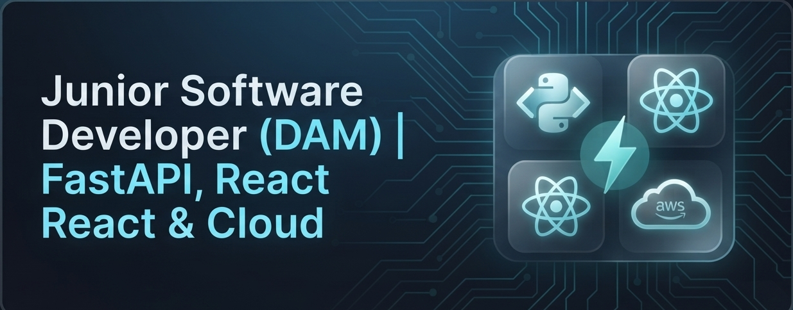

  

  <b>Junior Software Developer (DAM) | Python & JavaScript | Cloud & Systems Enthusiast</b>

   ¡Hola! Soy <b>Briyit Rodriguez</b>. Actualmente cursando el ciclo superior de <b>Desarrollo de Aplicaciones Multiplataforma (DAM)</b>.
  Apasionada por el diseño y construcción de software robusto, APIs eficientes y la arquitectura de aplicaciones. Combino mi base sólida en administración de sistemas y entornos cloud con el desarrollo moderno de software.

   <b><a href="https://portafolio-605379117764.europe-west1.run.app/" target="_blank"> Visita mi Portafolio Web</a></b>

---

## Proyectos Destacados

* **[Supporting Enterprise (CRM & Plataforma Interna)](https://github.com/Briy1t/supporting-service-platform)**
  * *Stack:* FastAPI, Python, SQLAlchemy, PostgreSQL, Alembic, React, Tailwind CSS.
  * *Descripción:* Plataforma empresarial modular diseñada para la gestión integral de clientes, contratos y personal técnico. Incluye tableros Kanban y pasarela de endpoints para la comunicación con la web corporativa. *(Repositorio actualmente en proceso de documentación para su apertura).*

* **[ZENIT – Sistema de Autogestión Emocional](https://github.com/Briy1t/zenit)**
  * *Stack:* FastAPI, SQLite, JavaScript, Docker.
  * *Descripción:* Aplicación web para el seguimiento del bienestar personal, con autenticación segura (hashing), dashboards interactivos y despliegue continuo en Google Cloud Run mediante CI/CD. La base de datos se encuentra pausada...

* **[EC2 Hardened Node & CV Deployment (AWS)](https://github.com/Briy1t/AWS-Learning-Path/blob/main/EC2_Hardened_Node_Deployment.md)**
  * *Stack:* AWS (EC2, AMI, Auto Scaling), Linux, Apache.
  * *Descripción:* Proyecto de infraestructura en la nube enfocado en la instalación y hardening de un servidor web Linux, automatización con scripts de autocuración, creación de AMIs y despliegue de mi CV digital.

---

## Stack Tecnológico (Development & Systems)

| Categoría | Tecnologías |
| :--- | :--- |
| **Backend & APIs** |    |
| **Frontend & UI** |   |
| **Bases de Datos & Tools** |    |
| **Cloud & Systems** |    |

---

## Repositorios de Aprendizaje

* [AWS Learning Path](https://github.com/Briy1t/AWS-Learning-Path) - Notas y arquitecturas sobre servicios Cloud.
* [Linux Learning Notes](https://github.com/Briy1t/linux-learning-notes) - Guías de administración y scripting en Bash.

---

## Conectemos

* **LinkedIn:** [Lisett Rodriguez Rodriguez](https://www.linkedin.com/in/liset-rodriguez-astros/)
* **Email:** lisetrodriguezastros@gmail.com

---
